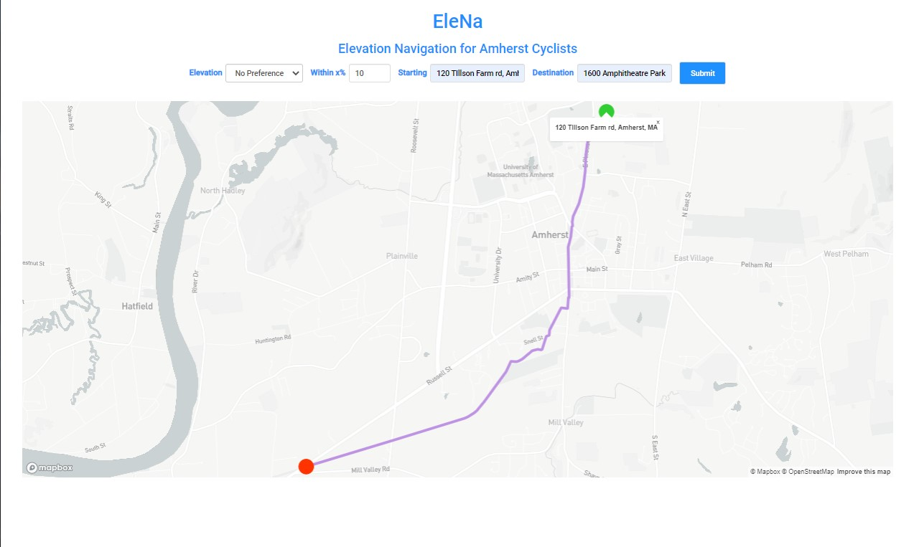

# EleNa: Elevation Navigation System

## Description
Navigation system for shortest distance path considering minimum and maximum elevation gain.

## Resources Used
* Spring Boot
* Hibernate
* PostgreSQL with PostGIS
* Mapbox GL JS
* Graph Algorithms
    * A* Search algorithm with elevation gain weighted paths
    * Dijkstra's algorithm
    * Yen's algorithm

## How to Run
1. Install [Maven](https://maven.apache.org/download.cgi) build tool
2. Import all Maven repositories
3. Set up database
2. To Run
    1. Either run EleNaApplication with Intellij
    2. Or from root directory type `./mvnw spring-boot:run`
3. Go to localhost:8080
    * The application will load an in memory Graph object to route from.
    * You must delete the nodes.bin and edges.bin files each time you input new osm data.

## Database setup
1. Download [postgres with stackbuilder](https://www.enterprisedb.com/downloads/postgres-postgresql-downloads#windows) all default settings port 5432
2. Launch stackbuilder and download PostGIS under Spatial Extensions 
3. Launch pgadmin4
4. Create database elenaDb with password 'password'
5. Go to localhost:8080/importData?path=**yourOsmFilePath** 
inputting your OSM file path to parse the osm file and input the node and edge values into the elenaDb. Make sure you have forward slashes path1/path2

## Adding dependencies
1. Go to maven repository online and copy and paste the dependency into pom.xml and import them as libraries in intellij

## How to Test 
Running all unit tests
1. In root directory type `mvn test`
***
# Documentation
## PostGIS (Geographic Information System) Docs
PostGIS enables geometry and geography data types such as Point which has coordinates and spatial indexing to 
enable useful queries such as 
* [ST_Distance(geography, geography) returns double](https://postgis.net/docs/ST_Distance.html)
    * Distance between 2 points 
* [ST_Buffer(geography, float8) returns geography](https://postgis.net/docs/ST_Buffer.html)
    * Buffer that returns all points less than or equal to the distance of the radius of the buffer 
1. [PostGis DB Intro](https://postgis.net/workshops/postgis-intro/geography.html) and query list
2. [Hibernate object relational mapping(ORM) to PostGis DB](https://docs.jboss.org/hibernate/orm/5.2/userguide/html_single/Hibernate_User_Guide.html#spatial-overview)
3. [Point Java class](https://locationtech.github.io/jts/javadoc/org/locationtech/jts/geom/Point.html) with coordinate error checking and the same useful methods in PostGIS

## Mapbox GL JS Docs
Using MapBox GL JS API to draw customized routes
* (Lat, Long) pairs
* Flow
    * user input submit-> get path coordinates from routing -> draw GeoJSON line on map
1. [Fit to the bounds of a linestring](https://docs.mapbox.com/mapbox-gl-js/example/zoomto-linestring/_)
2. [Adding a GeoJSON line](https://docs.mapbox.com/mapbox-gl-js/example/geojson-line/)
3. [Mapbox directions](https://docs.mapbox.com/help/how-mapbox-works/directions/)

## Notes
* PostGIS point is longitude, latitude
* Mapbox point is reversed with latitude, longitude
* [Mapbox vs Leaftlet vs OSM](https://stackoverflow.com/questions/12262163/what-are-leaflet-and-mapbox-and-what-are-their-differences)

## Using LiveReload
1. Download chrome extension [Live Reload](https://chrome.google.com/webstore/detail/livereload/jnihajbhpnppcggbcgedagnkighmdlei)
2. Go to localhost:8080 and click the LiveReload icon to enable it on localhost:8080
3. Recompile any java file to trigger the live reload so you don't have to restart the server to see changes

